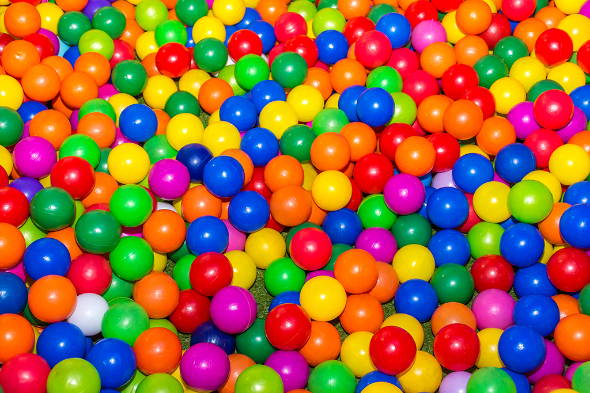

# Color/Ball (if you want) Tracker
This repository contains an image and video filter framework and color-tracking filter for my APCS class.

## Guide Handbook Manual Instructional Booklet
* Run _RunMe.java_ and enter 'ColorTrack'
* Clicking a pixel on the displayed image selects that pixels color for tracking
* Delete target tracking colors with 'Space'
* Adjustable threshold for color difference (Use 'E' to increase it, and 'D' to decrease it) to aid tracking